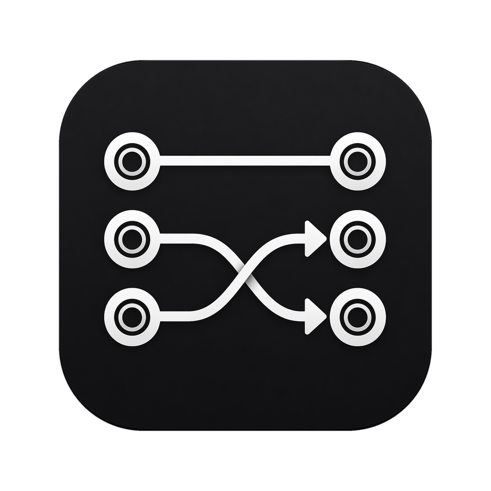
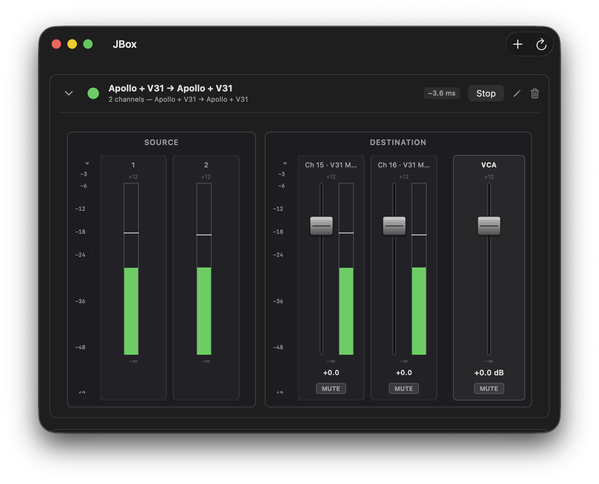

  

# JBox

  
  
  
  
  

**A native macOS audio routing utility.** JBox routes selected channels from one Core Audio device to selected channels on another, in real time, with low latency and robust drift correction between independent clocks.

---

## About this project

This project was developed by a professional developer working outside their primary tech stack and using Claude Code. The engine, app, and tooling were built almost entirely through agentic coding — the human role was design intent, review, and judgment; the agent did the typing.

It started as a personal project out of a need to play a Roland V31 drum module live and hear it through studio monitors connected to a UA Apollo Twin outputs, with the signal processed through Apollo Console for EQ, compression, and reverb. JBox is the routing layer that makes that flow work.

What shipped, though, is a generic Core Audio routing tool — nothing in the engine knows about that hardware.

---

## What JBox does

JBox routes selected channels of one Core Audio device to selected channels of another, in real time. Source and destination can be the same physical interface (e.g., feeding a hardware input into that interface's DSP-routable channels) or two different devices — JBox does not care which direction the user thinks of as "output" vs "input"; it works at the Core Audio device + channel level.

  

- **Arbitrary 1:N channel mapping** — pick any source channels, any destination channels, map them in any order. A single source channel may feed multiple destination channels (fan-out); multi-source summing (fan-in) is out of scope.
- **Multiple simultaneous routes** — more like a patchbay than a single-pair bridge.
- **Automatic drift correction** between devices with independent hardware clocks.
- **Automatic sample-rate conversion** when source and destination rates differ.
- **Graceful handling** of device disconnect / reconnect and missing-on-launch cases.

Unlike macOS Aggregate Devices — the built-in mechanism for combining multiple audio interfaces — JBox does not create a system-wide composite device. Routes are per-app, isolated, and dynamic. Other apps sharing the same hardware are unaffected.

---

## Who this is for

Anyone on macOS who wants to route audio between two Core Audio devices — picking exact source and destination channels, including the destination interface's virtual / DSP-routable channels — without building a macOS Aggregate Device.

A typical example: routing a hardware instrument or external sound module into specific channels on an audio interface — often the interface's virtual / DSP-routable channels (vendor labelling varies: "virtual inputs", "virtual outputs", "monitor returns", console-bus channels, etc.) — so the interface's DSP / console software can apply inserts, sends, or effects to that signal.

---

## What JBox is not

- **Not a mixer.** No summing, no gain, no mute. 1:N routing only — a source channel can feed many destinations (fan-out), but two sources cannot combine into one destination (fan-in / summing stays out of scope).
- **Not a DAW.** No timeline, no plugins, no recording, no MIDI.
- **Not a virtual audio driver.** JBox does not ship its own audio device. For the multi-source live-monitoring case (a hardware source + media apps reaching the same physical monitor outs), the recommended topology uses a macOS aggregate device plus the destination interface's hardware mixer — see [`docs/spec.md` § 2.13](./docs/spec.md#213-multi-source-low-latency-monitoring-topology). Users without a hardware-mixer-equipped interface can substitute a third-party loopback driver such as [BlackHole](https://github.com/ExistentialAudio/BlackHole) for the aggregate; JBox treats it as an ordinary Core Audio device and needs no driver-specific code.
- **Not a network audio tool.** No Dante, no AVB, no NDI, no IP streaming.

---

## Install

- Download the latest `Jbox-<version>.dmg` from the [Releases page](https://github.com/sha1n/jbox/releases).
- Drag `Jbox.app` to `/Applications` (or any directory you like).
- The app is **ad-hoc signed, not notarized**. On first launch macOS will block it; right-click → Open once to approve. The bundled `READ-THIS-FIRST.txt` walks through it.
- macOS prompts for audio-device access on first launch. Grant it.

Building from source? See [`docs/development.md`](./docs/development.md).

---

## Documentation

- **[`docs/spec.md`](./docs/spec.md)** — authoritative technical design (architecture, audio engine internals, data model, UI design, testing & build).
- **[`docs/plan.md`](./docs/plan.md)** — phased implementation roadmap and status detail.
- **[`docs/releases.md`](./docs/releases.md)** — release pipeline walk-through.
- **[`docs/development.md`](./docs/development.md)** — building from source, running tests, debugging, log queries.

---

## Status

Pre-1.0. The engine and SwiftUI app are feature-complete for the v1.0.0 scope below; release hardening (real-hardware soak, latency measurement, lint setup, and the v1 tag) is the remaining work. See [`docs/plan.md`](./docs/plan.md) for per-phase detail.

**Scope for v1.0.0** (what the first release will do):

- Route selected channels of one Core Audio device to selected channels of another (arbitrary 1:N mapping; fan-out allowed, fan-in deferred).
- Multiple simultaneous routes, each independently started / stopped.
- Auto-resampling when source and destination sample rates differ.
- Drift correction between independent device clocks.
- Auto-waiting for missing devices; auto-recovery on device return.
- **Tiered latency modes** per route (Off / Low / Performance) — ring-sizing presets that govern drift-sampler residency; a direct-monitor fast path bypasses the ring + converter entirely for same-device (aggregate) Performance routes. On Performance, the user can also pick a per-route Buffer Size *preference* — JBox writes it once via `kAudioDevicePropertyBufferFrameSize` (no hog mode), and macOS resolves the actual buffer as the max across all active clients.
- **Per-route latency pill** plus an Advanced-only diagnostics panel with the full component breakdown.
- SwiftUI main window + menu bar extra + preferences.
- Ad-hoc signed `.app` for personal use; unsigned `.dmg` lane for small-audience sharing.

Explicitly **deferred** beyond v1 (see [`docs/spec.md` § Appendix A](./docs/spec.md#appendix-a--deferred--out-of-scope) for the full list):

- Fan-in / summing / any mixer features (fan-out shipped in Phase 6).
- Per-route gain, mute, or pan.
- Scenes (named presets that activate groups of routes together) — design preserved at [`docs/spec.md` § 4.10](./docs/spec.md#410-future-feature--scenes-with-sidebar).
- Global hotkeys.
- Developer ID signing + notarization.
- Mac App Store (architecturally ruled out).
- Sparkle auto-update.
- Localization.
- Network audio / MIDI routing.
